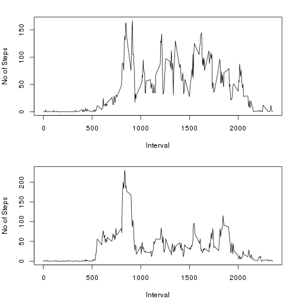

# This takes in a data from a personal activity monitoring device & creates a report


### Step 1. Load the data


```r
library( data.table )
```

```
## data.table 1.9.6  For help type ?data.table or https://github.com/Rdatatable/data.table/wiki
```

```
## The fastest way to learn (by data.table authors): https://www.datacamp.com/courses/data-analysis-the-data-table-way
```

```r
dt <- fread( "activity.csv" )
```


### Step 2a: Draw Histogram


```r
hist( dt$steps, ylim = c( 0L, nrow( dt ) ) )
```


### Step 2b: Compute mean & median of steps taken


```r
Mean <- mean( dt$steps, na.rm = T )
Median <- median( dt$steps, na.rm = T )
```

Mean: 37.3825996
Median: 0


### Step 3: Average daily activity pattern


```r
GetRwMeans <- function( dt )
{
  wDT <- dcast( dt, interval ~ date, value.var = "steps" )
  wDT2 <- wDT[ , -1, with = F ]
  a_res <- rowMeans( wDT2, na.rm = T )
  wDT[ , RwMeans := a_res ]
  
  return( wDT )
}

wDT <- GetRwMeans( dt )
a_MeanSteps <- wDT[[ "RwMeans" ]]

plot( wDT$interval, a_MeanSteps, type = "l" )
```


```r
Int_wMaxSteps <- wDT$interval[ which( a_MeanSteps == max( a_MeanSteps ) ) ]
```

Interval with most steps: 835


### Step 4: Impute missing values

```r
step_Nof_na <- sum( is.na( dt$steps ) )  # Comp ttl # of NAs

wDT3 <- wDT[ , -1, with = F ]  # Start imputing using a_MeanSteps computed above
wDT3 <- wDT3[ , !( colnames( wDT3 ) %in% "RwMeans" ), with = F ]

for( i in 1L:ncol( wDT3 ) )
{
  a_tmp <- wDT3[[ i ]]
  a_tmp <- ifelse( is.na( a_tmp ) == T, round( a_MeanSteps ), a_tmp )
  
  wDT3[ , i := as.integer( a_tmp ), with = F ]
}

invisible( wDT3[ , interval := wDT$interval ] )


# Melt to resemble original dataset (but with NAs filled in)
invisible( dt2 <- melt( wDT3, id.vars = "interval", variable.name = "date", 
                        value.name = "steps", variable.factor = F ) )

Mean2 <- mean( dt2$steps )
Median2 <- median( dt2$steps )
```

Total number of missing values: 2304


```r
hist( dt2$steps, ylim = c( 0L, nrow( dt2 ) ) )
```



Mean: 37.3806922
Median: 0

Conclusion from imputing using mean of each interval:
It does not change the total mean and median much. The only significant effect
is that it raises the frequency of each step in the histogram. At the same time, the total daily number of steps will increase since previously-removed NAs are now imputed with figures


### Step 5: Compare weekdays and weekends


```r
library( lubridate )
```

```
## 
## Attaching package: 'lubridate'
```

```
## The following objects are masked from 'package:data.table':
## 
##     hour, mday, month, quarter, wday, week, yday, year
```

```
## The following object is masked from 'package:base':
## 
##     date
```

```r
dt2[ , date2 := fast_strptime( date, "%Y-%m-%d", lt = F ) ]
dt2[ , day := weekdays( date2 ) ]

dt2[ , weekday := ifelse( day %in% c( "Sunday", "Saturday" ), "Weekend", 
                          "Weekday" ) ]
dt2[ , weekday := factor( weekday )]


dt2_Wkend <- dt2[ weekday == "Weekend" ]
dt2_Wkday <- dt2[ weekday == "Weekday" ]

DT_Wkend <- GetRwMeans( dt2_Wkend )
DT_Wkday <- GetRwMeans( dt2_Wkday )

a_Mean_Wkend <- DT_Wkend[[ "RwMeans" ]]
a_Mean_Wkday <- DT_Wkday[[ "RwMeans" ]]

par( mfrow = c( 2, 1) )
par( mar = c( 4, 4, 2, 2 ) )
plot( wDT$interval, a_Mean_Wkend, xlab = "Interval", ylab = "No of Steps", 
      type = "l" )
plot( wDT$interval, a_Mean_Wkday, xlab = "Interval", ylab = "No of Steps",
      type = "l" )
```


